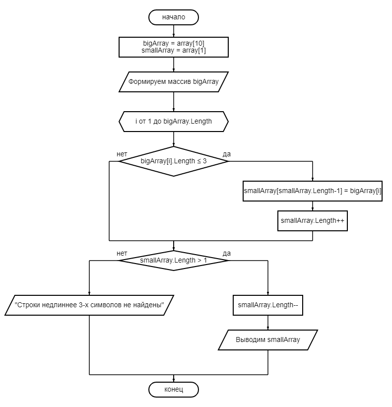

# Описание блок-схемы

1. Создаём массив **bigArray**, в котором будем хранить все строки. Пусть его длина будет **10**, но здесь это не особо важно.
2. Создаём массив **smallArray**, в котором будем хранить только нужные нам строки - с длинной не более 3-х символов. Нулевой массив создать не можем. Пусть сначала длина будет **1**. Это уже более важно.
3. Далее заполняем массив **bigArray**, например, через ввод с клавиатуры
4. Проходим по всем элементам массива **bigArray**.

- Если длина строки, хранящейся в элементе массива не более 3-х символов, то сохраняем эту строку в элемент массива **smallArray**. Номер этого элемента должен быть на **1** меньше длины массива **smallArray**. Затем увеличиваем длину массива **smallArray**, чтобы далее можно было добавить следующий элемент
5. Если длина массива **smallArray** больше изначальной длины **1**, значит мы нашли хотя бы одну подходящую строку.
- *Тогда*: Уменьшаем длину массива **smallArray** на 1, т.к. больше в него мы ничего сохранять не будем, и сейчас в последнем элемента хранится пустая строка, коорая нам не нужна. Выводим массив **smallArray**.
- *Иначе*: Выводим уведомление о том, что мы ничего не нашли
---
## Изображение блок-схемы

---
## Где найти код для решения этой задачи
[Ссылка на репозиторий...](https://github.com/deejay-oukay/Final-test-work "Ссылка на репозиторий")
